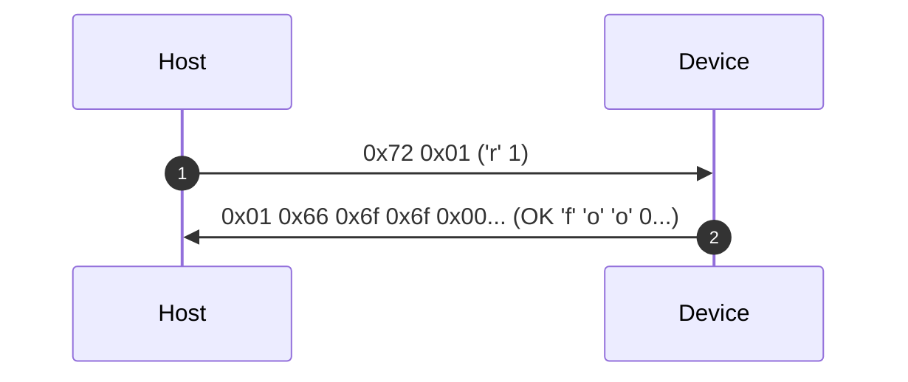
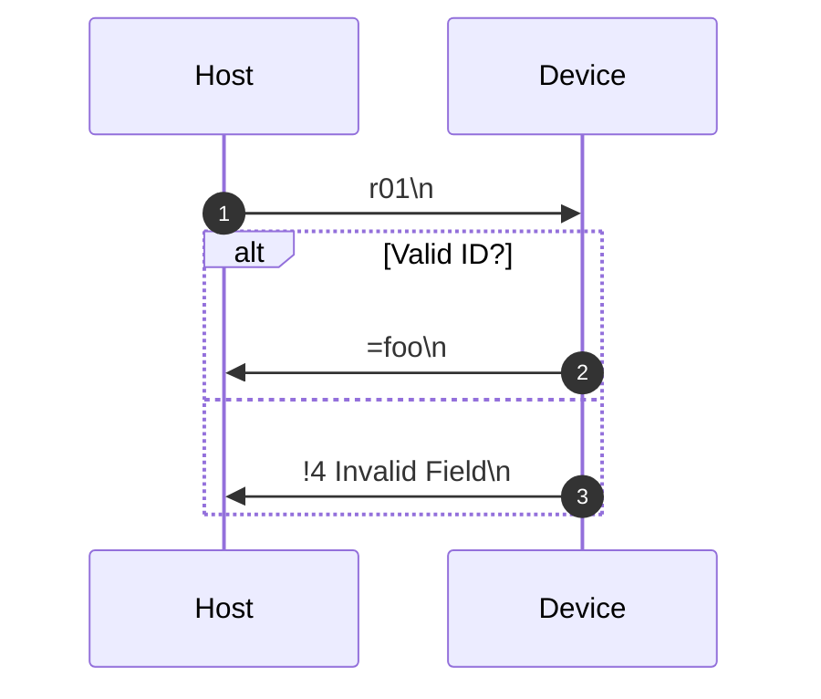

# Protocol

The Elytra protocol is unary (single request/single response pair) and stateless.
Depending on the transport, it's either optimized for human read/write (serial) or for size/simplicity (WebUSB).

|                       | WebUSB                 | Serial                 |
|-----------------------|------------------------|------------------------|
| **Numbers** | little endian bytes <br/> `0xcd 0xab`  | ascii big endian bytes<br/> `'abcd'`                |
| **Message End** | zero byte padding up to 64 bytes <br/>`0x00 0x00 0x00...`  | newline <br/>`'\n'` (`0x0d`)                |


## WebUSB
Communication over WebUSB is done using pairs of 64 byte packages. Host sends a command and the device replies, no state is kept between messages.
Each request message start with a command byte (which correspond to an ascii character) followed by command arguments in "byte form" (numbers are not sent as ascii characters, but rather their actual byte values) in little endian order.  
The devices responds with a message starting with either `1`, followed by the command return value for successful commands 
or `0` followed by an [error code](#errors) and optionally a short error message (up to 62 bytes UTF-8, zero padded).



## Serial



## Commands

| Char      | Name                   | Arguments    | Returns            |
|-----------|------------------------|--------------|--------------------|
| `r`       | [ReadProp](#readprop)  | `<PropID>`   | `<VALUE>...`       |
| `w`       | [WriteProp](#writeprop)| `<PropID>` `<VALUE>...`  | *none* |
| `R`       | [ReadInfo](#readinfo)  | `<InfoID>`   | `<VALUE>...`       |
| `W`       | [WriteInfo](#writeinfo)| `<InfoID>` `<VALUE>...`  | *none* |
| `q`       | [Query](#query)        | `<EntryType>` `<EntryID>` `<Target>` `[TargetIndex]`[^qti_note] | `<DATA>...` |
| `a`       | [Action](#action)      | `<ActionId>` | *none*             |
| `m`       | [Meta](#meta)          | *none*       | <MetaInfo>         |
| `\0`,`\n` | [Noop](#noop)          | *none*       | *none*             |

[^qti_note]: `QueryTargetIndex` is two bytes (unsigned 16bit integer). For WebUSB they are expected to be in Little Endian,
             but serial instead uses Big Endian.

### ReadProp
**Arguments:**
- `<PropID>` - Property ID, 1 byte

Reads the data from the [Prop](./glossary.md#Prop) field specified by `PropID`.

### WriteProp
**Arguments:**
- `<PropID>` - Property ID, 1 byte
- `<VALUE>` - Property value, 1-63 byte

Writes the `VALUE` to the [Prop](./glossary.md#Prop) field specified by `PropID`.

### ReadInfo
**Arguments:**
- `<InfoID>` 

Reads the data from the [Info](./glossary.md#Info) field specified by `InfoID`.

### WriteInfo
**Arguments:**
- `<InfoID>` - Information ID, 1 byte
- `<VALUE>` - Information value, 1-63 byte

Writes the `VALUE` to the [Info](./glossary.md#Info) field specified by `InfoID`.

### Query
**Arguments:**
- `EntryType`
- `EntryID`
- `Target`
- `TargetIndex` (only for `Option` target)

Requests information about the specified entry of `EntryType`, identified by `EntryID`.
Depending on which target is requested, the response will be the following:

- **Field**: A [FieldInfo] struct, containing basic information about the entry.  

- **Icon**: A [Lucide](https://lucide.dev/icons/) icon ID that represents the entry.  

- **Help**: A help/description text about the entry.  
- **Layout**: A list of EntryType + EntryIndex pairs (two bytes) that describe a sections layout.  
- **Option**: The value for a fields options, as identified by `TargetIndex`. Used for auto-complete/dropdown type fields.  

**Example**:  
```
> qp00o0009          // Query Property 0 Option 9 (zero-based)
< =October           // OK Option Value 

> qs01l              // Query Section 01 Layout
< =i0i1p0p1p2        // OK Info0 Info1 Prop0 Prop1 Prop2
```

### Action
**Arguments:**
-  `<ActionId>`


### Meta
**Arguments:** *none* 


### Noop
**Arguments:** *none*  
Used verify the connection to the device without performing any work.


### Query Targets
| Char  | Name              | Description | 
|-------|-------------------|-------------|
| `f`   | Field     |
| `i`   | Icon      |
| `h`   | Help      |
| `l`   | Layout    | 
| `o`   | Option    |

### Errors
| Code  | Name              | Description | 
|-------|-------------------|-------------|
| `0x1` | Invalid Command   | The command is not recognized  |
| `0x2` | Missing Argument  | The command needs another arugment |
| `0x3` | Invalid Data      | The supplied data is not valid for the specified field |
| `0x4` | Invalid Field     | The field index is larger than (or equal to) the field count   |
| `0x5` | Invalid Section   | The section index is larger than (or equal to) the section count |
| `0x6` | Invalid Action    | The action index is larger than (or equal to) the action count |
| `0x7` | Invalid Entry     | The entry index is larger than (or equal to) the entry count |
| `0x8` | Invalid Query     | The query target is not recognized |
| `0x9` | Invalid Option    | The option index is larger than (or equal to) the option count |
| `0xA` | Not Supported     | The command is not supported by the device |
| `0xB` | Failed            | The command could not be executed |
| `0xC` | No Content        | The specified entry has no content for the specified target |